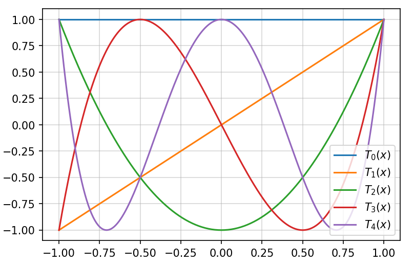

# Aproximação de séries temporais com polinômio de Chebyshev

**Neste projetos tratamos**

<u>Teoria:</u>
*   Relação recursiva dos polinômios de Chebyshev
*   Séries de Chebyshev
*   Mínimos Quadrados com Séries de Chebyshev

<u>Aplicações:</u>
* Tendência de uma série temporal (Emissões de CO2 na atmosfera)
* Aproximação de baixa e alta ordem
* Aproximação por partes
* Remoção de ruído de Eletrocardiograma

<u>Este projeto está desenvolvido como vídeo-tutorial neste link: https://youtu.be/_jlSkH-O8do</u>

